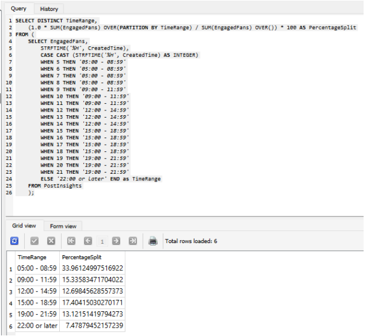

# Data Querying with SQL

## Overview

This project is aimed to help with their social media strategy and to provide advice on the potential launch of an English version of Datazine magazine.

The following is the information that we need to analyze:
- Key indicators, such as location, gender, age, and language of our users.
- The best time of day, and the best day of week to publish Facebook content.
- Assess the feasibility of launching a US English version.

## Querying

Queries to create a database can be found in [`create_queries.sql`](./queries/create_queries.sql).
Queries to analyze the data can be found in [`select_queries.sql`](./queries/select_queries.sql).

### Section 1: Basic Summary Statistics
1. How many unique countries are there?

2. How many unique cities are there?

3. How many unique languages are there?

4. What is the daily average reach of the posts (i.e DailyPostsReach) on the global page over the period?

5. What is the daily average engagement rate (i.e. NewLikes) on the global page over the period?

### Section 2: Location Analysis

6. What are the top 10 countries (considering the number of fans)?
Show a table of results containing the following columns: CountryCode, CountryName, NumberOfFans

7. What are the top 10 countries by penetration ratio (i.e. the % of the country populationthat are fans)?
Show a table of results containing the following columns: CountryName, PenetrationRatio, NumberOfFans, Population

8. What are the bottom 10 cities (considering the number of fans) among countries with a population over 20 million?
Show a table of results containing the following columns: CountryName, City, NumberOfFans, Population

### Section 3: Fan Analysis

9. What is the split of page fans across age groups (in %)?
Show a table of results containing the following columns: AgeGroup, PercentageOfFans

10. What is the split of page fans by gender (in %)?
Show a table of results containing the following columns: Gender, PercentageOfFans

### Section 4: Language Analysis

11. What is the number of the fans that have declared English as their primary language?

12. What is the percentage of the fans that have declared English as their primary language?

13. Based on the number of fans who have declared English as their primary language and living in the US, what is the potential buying power that can be accessed?

### Section 5: Fan Engagement
14. What is the split of the EngagedFans across the days of the week (monday, tuesday,...)?
Give the result as a table with the following columns: DayOfWeek, PercentageSplit

15. What is the split of the EngagedFans by time of the day?
Give the result as a table with the following columns: TimeRange, Precentage

### Section 6: Optional Challenging Queries

16. Compute the change in PostClicks, EngagedFans and Reach from one month to the next.
Give the result as a table with the following columns: FromMonth, ToMonth, DeltaPostClicks, DeltaEngagedFans, DeltaReach

## Recommendations  

Based on the analysis, **Datazine** can optimize engagement by:  

- Increasing post frequency, especially on **Mondays, Tuesdays, and Saturdays**, to maximize audience reach.  
- Posting between **5-9 AM**, when engagement levels are at their peak.  
- Prioritizing content in **February, March, and November**, as these months see the highest interaction from fans.

## Presentation

- You can access the presentation slides [here](./presentation/Borsukov_Arseniy_3_presentation_102024.pdf).